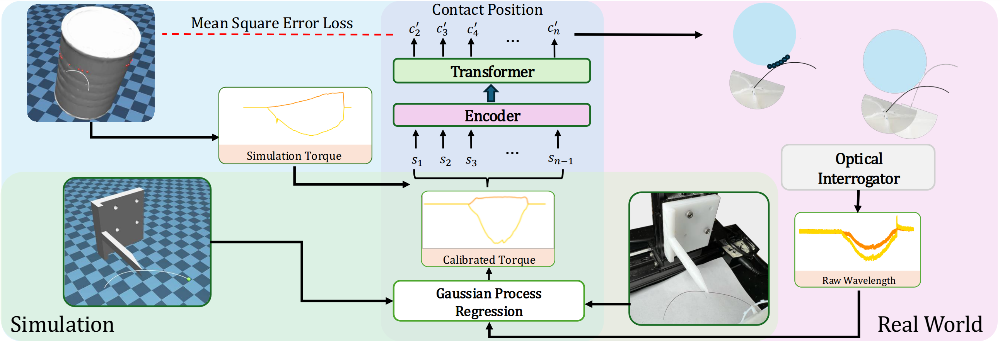

# Whisker-Inspired Tactile Sensing: A Sim2Real Approach for Precise Underwater Contact Tracking

This repository is the official implementation of the paper **"Whisker-Inspired Tactile Sensing: A Sim2Real Approach for Precise Underwater Contact Tracking"** ([arXiv link](https://arxiv.org/pdf/2410.14005)).



Inspired by aquatic mammals like pinnipeds, which use whiskers to detect objects and analyze water movements, we present a novel approach for underwater tactile sensing using Fiber Bragg Grating (FBG) technology. These passive whiskers, mounted externally on a robot, enable environmental perception through light, non-intrusive contacts. Our approach involves a **sim-to-real learning framework**, where we collect extensive simulation data, perform calibration, and transfer the trained model to real-world settings. Our experiments demonstrate **sub-2mm contact tracking accuracy**, even without precise robot proprioception, and generalization to unseen objects.

Given that our major contributions focus on a **machine learning approach leveraging whisker simulation for expedited training**, we are open-sourcing all related software to facilitate research replication and further development.

### Specifically, we provide:
- **CAD model files** for the whisker sensor design *(TBD due to ongoing disclosure with Stanford OTL)*;
- **Standard mesh and model files** for the FEA used in Bragg cell placement *(TBD due to ongoing disclosure with Stanford OTL)*;
- **Simulation code** for whisker dynamics in MuJoCo and contact data collection;
- **Deep learning model code**, including structure, training/testing scripts, and a pretrained model.


## Basic Principle

We are currently using Nitinol wire as our whisker, which exhibits large deflections due to its high flexibility and superelasticity. Traditional beam theories, such as Euler-Bernoulli and Timoshenko, assume small deflections and linear elasticity, making them unsuitable for our application. Instead, the closest theoretical framework is **Cosserat rod theory**, which is specifically designed for slender elastic rods undergoing large deflections and rotations.

### Simulation Framework

We chose **MuJoCo** as our simulation environment because it employs a discrete **Cosserat approximation** for flexible structures, using a chain of links and joints to approximate continuous rods. This is implemented in MuJoCo through its *cable* object:

- **Documentation:** [MuJoCo Composite Objects](https://mujoco.readthedocs.io/en/stable/modeling.html#composite-objects)
- **GitHub Repo:** [MuJoCo Elasticity Plugin](https://github.com/google-deepmind/mujoco/tree/main/plugin/elasticity)

From MuJoCo’s codebase, we derive their governing equations, based on the **discrete Cosserat formulation**, which balances forces and moments between consecutive segments:

$$
\text{Force Balance: } \quad \frac{d\mathbf{n}}{ds} + \mathbf{f} = 0
$$

$$
\text{Moment Balance: } \quad \frac{d\mathbf{m}}{ds} + \mathbf{t} + \mathbf{r}(s) \times \mathbf{n} = 0
$$

$$
\boldsymbol{\gamma} = \mathbf{R}^T \frac{d\mathbf{r}}{ds} - \mathbf{e}_3, \quad
\boldsymbol{\kappa} = \mathbf{R}^T \frac{d\mathbf{R}}{ds}
$$

where $\mathbf{n}$ and $\mathbf{m}$ are internal force and moment per unit length, $\mathbf{f}$ and $\mathbf{t}$ are external force and torque per unit length, $\mathbf{r}(s)$ is the position vector along the rod, $\boldsymbol{\gamma}$ is the strain vector, $\mathbf{R}$ is the rotation matrix, and $\boldsymbol{\kappa}$ is the curvature vector.

The **MuJoCo Cosserat rod approximation** allows us to rapidly simulate whisker behavior, generating large datasets for deep learning model training within a few hours.

### Sensing with FBG Sensors

The **FBG sensors** are embedded in a 3D-printed resin structure, with the Nitinol whisker inserted next to the FBG location. When a force is applied to the whisker, it generates a torque at the base, deforming the structure. The FBG measures this deformation as a **wavelength shift**, governed by:

$$
\text{Base Torque: } \quad T = F \times L
$$

$$
\text{Base Bending Strain: } \quad \epsilon = \frac{T \times c}{EI}
$$

$$
\text{FBG Wavelength Shift: } \quad \Delta \lambda = \lambda_0 \times (1 - P_e) \epsilon
$$

where $L$ is the distance to the base, $c$ is the distance from the neutral axis to the FBG, $E$ is the elastic modulus, $I$ is the second moment of area, $P_e$ is the effective photoelastic constant, and $\lambda_0$ is the original FBG wavelength.

### Machine Learning for Contact Tracking

From Cosserat rod theory, direct contact position estimation using base torque alone is infeasible due to the 2D boundary condition at one end. Instead, we employ **deep learning models**, which learn the complex mapping by analyzing torque sequences in simulation.

Furthermore, the torque-to-wavelength relationship is approximately **linear**, but fabrication noise, sim-to-real discrepancies, and material variations introduce **nonlinearity**. Rather than parameterizing these effects, we use **Gaussian Process Regression (GPR)** to map **wavelength shifts to simulated torques** for each whisker sensor. GPR effectively captures **nonlinear relationships and uncertainties**, ensuring robustness against fabrication errors and sim-to-real gaps.


## System Setup

This repository has been tested with the following system configuration:
- **Operating System**: Ubuntu 20.04
- **GPU**: NVIDIA RTX 3090
- **CPU**: AMD Ryzen 9 7900X

The repository should also work with other configurations, though some dependencies and performance may vary.

## Setup Virtual Environment

To set up the required environment:

1. Create a virtual environment using Conda with Python 3.8:
   ```bash
   conda env create -f environment.yml
   conda activate whisker_env
   ```
3. Install the modified version of GPy:
   ```bash
   cd lib/GPy
   python setup.py develop
   ```

## Data Collection

1. **Download YCB Objects:** Run the following script to download YCB objects:

   ```bash
   cd mujoco_xml/asset/YCB_asset
   python downloader.py
   ```

2. **Decompose CAD Models:** Run the convex decomposition script to prepare the models for MuJoCo:

   ```bash
   python convex_decomp.py
   ```

3. **Start Data Collection:** Run the data collection script:

   ```bash
   python data_collection.py
   ```

   - The data collection configuration can be found in the config folder.
   - It is recommended to run multiple threads for parallel data collection.

4. **Collect Sim Calibration Data:** Run the calibration script to collect contact points in simulation:

   ```bash
   python calibration.py
   ```

## Real2Sim

When you have the calibration data from simulation, please use the `px`, `py`, `pz` in the CSV file to collect data at the exactly same contact point on the whisker. Note that the `px`, `py`, `pz` might not be in the same coordinate of your stage, so you might need some transformation to properly collect the data.

After you have both real and sim data for the same contact point, normalize them with their min-max values to prepare for Gaussian Process Regression. Example files of normalized real-world and simulation calibration data can be found in the `real2sim/data/Gpy_data` folder.

Now run `apply_Gpy.py` to obtain the Gaussian Process Regression model and transform real-world wavelength to simulated torque. Example real-world testing data can be found in `real2sim/data/real_world_data`. The mapped data can be found in `whiserNet/data/test`.

```bash
python apply_Gpy.py
```

## WhiskerNet

After data collection, run `train.py` to start training. The config file can be found in `whiskerNet/scripts/config/train.yaml`.

```bash
cd whiserNet/scripts
python train.py
```

The checkpoints will be saved in `whisker/scripts/ckpt`. We have released our checkpoint in `whisker/scripts/ckpt/transformer/best.pth` for testing.

An example of testing and visualization is shown in `visulization.ipynb`.

